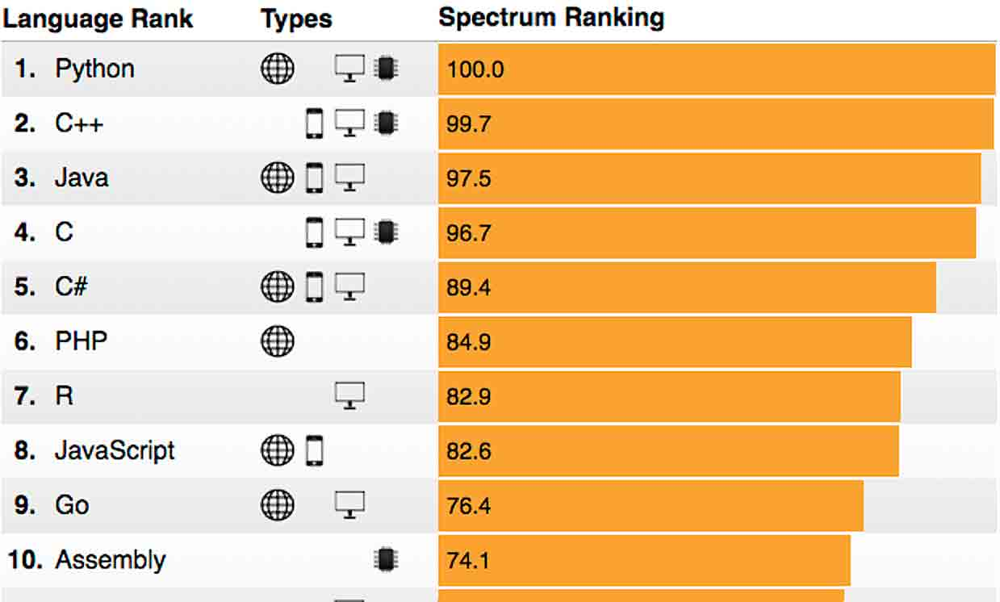
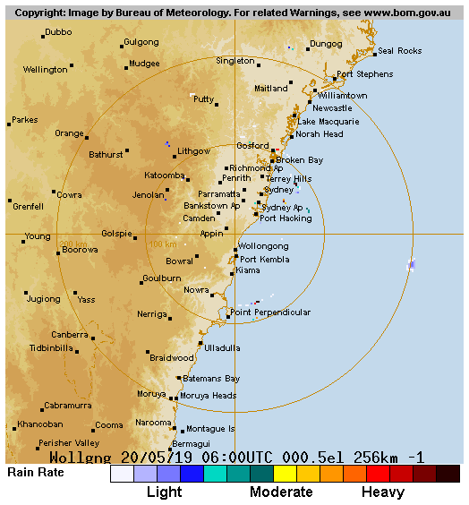
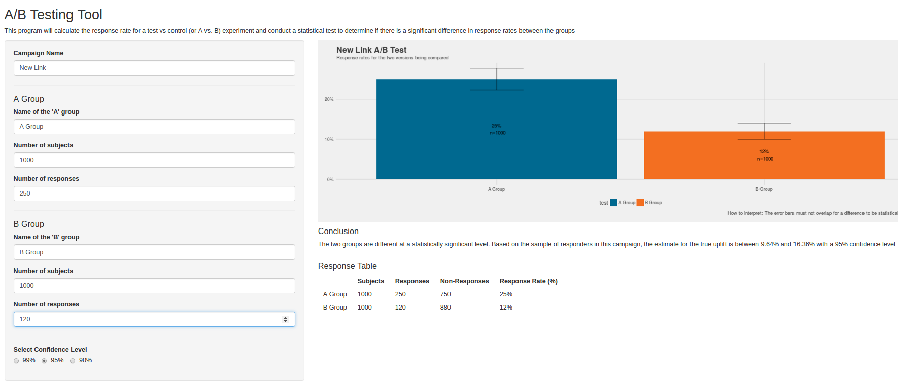

class: center, middle

```{r setup, include=FALSE}
knitr::opts_chunk$set(fig.dim=c(4.8, 4.5), fig.retina=2, out.width="100%")
```

```{css, echo=FALSE}
pre {
  max-width: 100%;
  overflow-x: scroll;
}

.left-code {
  color: #777;
  width: 38%;
  height: 92%;
  float: left;
  font-size: 70% 
}
.right-plot {
  width: 60%;
  float: right;
  padding-left: 1%;
}

.remark-code { font-family: 'Source Code Pro', 'Lucida Console', Monaco, monospace;
                                    font-size: 70%;
}

.inverse {
  background-color: #132734;
  color: #d6d6d6;
  text-shadow: 0 0 20px #333;
}

.title-slide {
  background-color: #132734;
  color: #d6d6d6;
  text-shadow: 0 0 20px #333;
  class: inverse, center, middle;
  background-image: url('img/logo.png');  
  background-position: 5% 98%;  
  background-size: 150px ;
}

```

# Key principles

`shareable -> reproducible -> publishable`

---
class: inverse, center, middle
background-image: url('img/logo.png')  
background-position: 5% 98%  
background-size: 150px  

# Why R?

---
background-image: url('img/R.png')  
background-position: 90% 8%  
background-size: 100px  


# R

The R programming language is a popular and open-source tool for data analysis and
statistical computing.    

https://www.r-project.org/  

+ Can handle data import, cleaning, analysis, visualisation and publishing  
+ Highly extensible through package ecosystem - new algos available faster   
+ Open Source  
+ Easy to learn from a non-CS background
+ GREAT community and documentation  



*https://spectrum.ieee.org/at-work/innovation/the-2018-top-programming-languages*

---
class: inverse, center, middle
background-image: url('img/logo.png')  
background-position: 5% 98%  
background-size: 150px  

# Getting Data   

R packages to get data and access API's

---

# Web Technologies  

R has a detailed task view of packages build to interface with the web.  

+ HTTP Requests  
+ XML / JSON  
+ Web Scraping  
+ Cloud Data Tools (AWS, BigQuery, ..)  
+ Social Media Clients

https://cran.r-project.org/web/views/WebTechnologies.html

---

background-image: url('img/bomrang.png')  
background-position: 90% 8%  
background-size: 100px  

# bomrang  

### Australian Government Bureau of Meteorology (BOM) Data Client.   

Provides functions to interface with Australian Government Bureau of Meteorology (BOM) data. 

Install from CRAN:   

```{r eval=FALSE, include=TRUE}
install.packages("bomrang")
```

---

background-image: url('img/bomrang.png')  
background-position: 90% 8%  
background-size: 100px  

# bomrang demo   

Get current forecast for Wollongong

```{r echo=TRUE, message=FALSE, warning=FALSE}
library(bomrang)
library(dplyr)

weather <- bomrang::get_current_weather(station_name = 'Bellambi')

weather %>% 
  filter(local_date_time_full == max(local_date_time_full)) %>% 
  select(full_name, local_date_time_full, air_temp, wind_dir, wind_spd_kt) 
```

---

background-image: url('img/bomrang.png')  
background-position: 90% 8%  
background-size: 100px  

# bomrang demo

Get radar imagery  

```{r echo=TRUE, message=FALSE, warning=FALSE}
library(bomrang)

imagery <- get_radar_imagery(product_id = "IDR032", path = 'img/radar.png') 
```




---
class: inverse, center, middle  
background-image: url('img/logo.png')  
background-position: 5% 98%  
background-size: 150px  


# Analysing Data  
faster and more interpretable EDA    

---

background-image: url('img/skimr.png')   
background-position: 90% 6%   
background-size: 100px    

# skimr  


skimr provides a frictionless approach to summary statistics which conforms to the principle of least surprise, displaying summary statistics the user can skim quickly to understand their data.  

Install the latest development version:   

```{r eval=FALSE, include=TRUE}
devtools::install_github("ropensci/skimr")
```  


---

background-image: url('img/skimr.png')   
background-position: 90% 6%   
background-size: 100px    

# skimr demo      

```{r include=FALSE}
options(width = 250)
```


```{r fig.height=6, fig.width=6, message=FALSE, warning=FALSE}
library(skimr)

skimr::skim(iris)
```


---
background-image: url('img/tidyverse.png')   
background-position: 90% 6%   
background-size: 100px  

# The tidyverse  

The tidyverse is an opinionated collection of R packages designed for data science. All packages share an underlying design philosophy, grammar, and data structures.   

Ideally suited for:  

+ Reading in data  
+ Manipulating and tidying data  
+ Visualisation of results  

https://www.tidyverse.org/  

Install from CRAN   

```{r eval=FALSE, include=TRUE}
install.packages('tidyverse')
``` 

---
background-image: url('img/tidyverse.png')   
background-position: 90% 4%   
background-size: 100px  

# tidyverse demo  

This example shows some more advanced use of data manipulation and visualisation. 

### Space launches
These are the data behind the "space launches" article, The space race is dominated by new contenders. Principal data came from the Jonathan McDowell's JSR Launch Vehicle Database, available online at http://www.planet4589.org/space/lvdb/index.html.


*Example adapted from from https://github.com/dgrtwo/data-screencasts/blob/master/space-launches.Rmd*  

*and the  [Tidy Tuesday Project](https://github.com/rfordatascience/tidytuesday)*

---

# Reading in data  

```{r message=FALSE, warning=FALSE}
library(tidyverse)

launches <- read_csv("https://raw.githubusercontent.com/rfordatascience/tidytuesday/master/data/2019/2019-01-15/launches.csv")

head(launches)
```

---

# Pre-processing   

+ Use of the pipe `%>%` operator improved readability with collaborators  
+ Ability to filter, aggregate, select columns, reorder, text manipulation  
+ Supports Non-Standard Evaluation (NSE)  

```{r message=FALSE, warning=FALSE}
launches_processed <- launches %>%
  filter(launch_date <= Sys.Date()) %>%
  filter(state_code == "US") %>%
  add_count(type) %>%
  filter(n >= 20) %>%
  mutate(type = fct_reorder(type, launch_date, min),
         agency_type = str_to_title(agency_type))
```


---
background-image: url('img/ggplot2.jpg')   
background-position: 90% 4%   
background-size: 100px 

# Data Visualisation with ggplot2  

`ggplot2` is a well known package for data visualisation based on [The Grammar of
Graphics](http://amzn.to/2ef1eWp).  

```{r eval=FALSE, include=TRUE}
install.packages('ggplot2')
```

Let's run through an example..  

---
background-image: url('img/ggplot2.jpg')   
background-position: 90% 4%   
background-size: 100px 

# Data Visualisation

.left-code[
```{r plot-code, fig.show="hide"}
 ggplot(data = launches_processed,
        aes(x = launch_date, 
            y = type)) +
  geom_point()
```
]

.right-plot[
`)
]

---
background-image: url('img/ggplot2.jpg')   
background-position: 90% 4%   
background-size: 100px 

# Data Visualisation

.left-code[
```{r plot-code2, fig.show="hide"}
  ggplot(launches_processed, 
        aes(x = launch_date, 
            y = type)) +
   geom_jitter(alpha = .25, 
               width = 0, 
               height = .2) 
```
]

.right-plot[
`)
]


---
background-image: url('img/ggplot2.jpg')   
background-position: 90% 4%   
background-size: 100px 

# Data Visualisation

.left-code[
```{r plot-code3, fig.show="hide"}
  ggplot(data = launches_processed, 
        aes(x = launch_date, 
            y = type,
            color = agency_type)) +
   geom_jitter(alpha = .25, 
               width = 0, 
               height = .2) +
  theme(legend.position = "bottom")
```
]

.right-plot[
`)
]

---
background-image: url('img/ggplot2.jpg')   
background-position: 90% 4%   
background-size: 100px 

# Data Visualisation

.left-code[
```{r plot-code4, fig.show="hide"}
  ggplot(launches_processed, 
        aes(x = launch_date, 
            y = type,
            color = agency_type)) +
   geom_jitter(alpha = .25, 
               width = 0, 
               height = .2) +
  labs(title = "Timeline of US space vehicles",
       x = "Launch date",
       y = "Vehicle type",
       color = "Agency type",
       subtitle = "Only vehicles with at least 20 launches") +
  theme_light() +
  theme(legend.position = "bottom") 
```
]

.right-plot[
`)
]

---
background-image: url('img/gganimate.png)      
background-position: 90% 4%    
background-size: 100px  

# Animated Visualisations  

the `gganimate` package can make animated visualisations easy by extending
the `ggplot2` API.

```{r echo=FALSE, out.width=400}
knitr::include_graphics('img/anim.gif')
```

---
# Modelling and Analysis

Traditionally a huge strength in R.

+ Linear models like `lm` and generalised linear models (`glm`)
+ Non-parametric models decision trees (`rpart`), and random forest (`rf`)  
+ Common API for modelling, traditionally a formula interface (below)  
+ Packages like `caret` attempt to standardise API for modelling,
tuning hyper-parameters and cross-validation across hundreds of models.  

```{r eval=FALSE, include=TRUE}
fit <- caret::train(label ~ x + y, 
                    data = training, 
                    method = "rf")
```


---
# Modelling and Analysis

```{r}
# fitting a linear model with the iris dataset.
fit <- lm(formula = Sepal.Width ~ Petal.Length + Petal.Width, data = iris)

summary(fit)
```


---
class: inverse, center, middle
background-image: url('img/logo.png')  
background-position: 5% 98%  
background-size: 150px  

# Working with others 

Version control and collaboration

---

# Git  / Github  

+ Powerful version control system used in software development  

+ Also well suited to managing research work  

+ Controls the 'source code' of your work with multiple contributors   


---

# Use cases for git in science  

1. Lab notebook  
2. Facilitating Collaboration  
3. Backup and Fail-safe against data loss  
4. Freedom to explore new ideas and methods  
5. Mechanism to solicit feedback and reviews  
6. Increase transparency and verifiability  
7. Managing large data
8. Lowering barriers to reuse


Ram, K. (2013). Git can facilitate greater reproducibility and increased transparency in science. Source Code for Biology and Medicine, 8(1). https://doi.org/10.1186/1751-0473-8-7

---

# Lots of great git resources:  

[Git for Scientists - Miles McBain](https://milesmcbain.github.io/git_4_sci/)

[Atlassian Git Tutorials](https://www.atlassian.com/git/tutorials)

[Git: A powerful tool to facilitate greater reproducibility and transparency in science](https://github.com/karthik/smb_git)  

[Git and Github - R Packages](http://r-pkgs.had.co.nz/git.html)

[A Quick Introduction to Version Control with Git and GitHub](https://journals.plos.org/ploscompbiol/article?id=10.1371/journal.pcbi.1004668)


---
class: inverse, center, middle
background-image: url('img/logo.png')  
background-position: 5% 98%  
background-size: 150px  

# Getting your work out there

Papers, Talks, Posters, Blogs and more

---
background-image: url('img/rmarkdown.png')   
background-position: 90% 4%   
background-size: 100px 

# R Markdown  

> R Markdown provides an authoring framework for data science. You can use a single R Markdown file to both
> + save and execute code  
> + generate high quality reports that can be shared with an audience

source: https://rmarkdown.rstudio.com/


---
background-image: url('img/rmarkdown.png')   
background-position: 90% 4%   
background-size: 100px 

# R Markdown Gallery

https://rmarkdown.rstudio.com/gallery.html

---
background-image: url('img/shiny.png')   
background-position: 90% 4%   
background-size: 100px  

# Shiny  

Shiny is a framework to build interactive web apps straight from
your R code.  

+ Get your code into users' hands
+ Easily deploy and host apps on the cloud  
+ Turn your research outputs into useful production ready tools

https://shiny.rstudio.com/

[Shiny User Showcase](https://www.rstudio.com/products/shiny/shiny-user-showcase/)

---
background-image: url('img/shiny.png')   
background-position: 90% 4%   
background-size: 100px  

# Shiny Demo  

https://deanmarchiori.shinyapps.io/abtester/



---

# R Packages  

> In R, the fundamental unit of shareable code is the package. A package bundles together code, data, documentation, and tests, and is easy to share with others

source: [R Packages - Hadley Wickham](http://r-pkgs.had.co.nz/intro.html)

### Why R Packages?  

+ Amplify your research work by turning it into open-source software  
+ Publish and licence your software to the community  
+ Ensure it can be run and maintained by others and not trapped on the 'C Drive'  

[ROpenSci](https://ropensci.org/) has a great model for promoting open data and
software for science.  

---

# R Packages  

```{r echo=FALSE, out.width=600}
knitr::include_graphics('img/pkg.png')
```

source: https://blog.revolutionanalytics.com/2017/01/cran-10000.html

---

# References  

Adam H Sparks, Mark Padgham, Hugh Parsonage and Keith Pembleton (2017). bomrang: Fetch Australian Government Bureau of
  Meteorology Weather Data The Journal of Open Source Software, 2(17). DOI: 10.21105/joss.00411

Adam H Sparks, Jonathan Carroll, Dean Marchiori, Mark Padgham, Hugh Parsonage and Keith Pembleton. (2018). bomrang: Australian
  government Bureau of Meteorology (BOM) data from R. R package version 0.4.0. https://CRAN.R-project.org/package=bomrang
  
Amelia McNamara, Eduardo Arino de la Rubia, Hao Zhu, Shannon Ellis and Michael Quinn (2019). skimr: Compact and Flexible
  Summaries of Data. R package version 1.0.6. https://github.com/ropenscilabs/skimr
  
Hadley Wickham (2017). tidyverse: Easily Install and Load the 'Tidyverse'. R package version 1.2.1.
  https://CRAN.R-project.org/package=tidyverse
  
JJ Allaire and Yihui Xie and Jonathan McPherson and Javier Luraschi and Kevin Ushey and Aron Atkins and Hadley Wickham and Joe
  Cheng and Winston Chang and Richard Iannone (2018). rmarkdown: Dynamic Documents for R. R package version 1.11. URL
  https://rmarkdown.rstudio.com.
  
---

# References (cont.)

Yihui Xie and J.J. Allaire and Garrett Grolemund (2018). R Markdown: The Definitive Guide. Chapman and Hall/CRC. ISBN 9781138359338. URL https://bookdown.org/yihui/rmarkdown.  
  
Winston Chang, Joe Cheng, JJ Allaire, Yihui Xie and Jonathan McPherson (2018). shiny: Web Application Framework for R. R package
  version 1.2.0. https://CRAN.R-project.org/package=shiny  
  
H. Wickham. ggplot2: Elegant Graphics for Data Analysis. Springer-Verlag New York, 2016.

Thomas Lin Pedersen and David Robinson (2019). gganimate: A Grammar of Animated Graphics. R package version 1.0.3. https://CRAN.R-project.org/package=gganimate

---
class: inverse, center, middle
background-image: url('img/logo.png')  
background-position: 5% 98%  
background-size: 150px  

# Thanks!

Fire some questions at me

